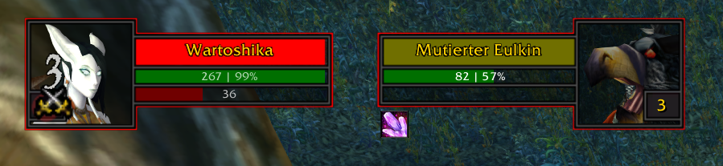
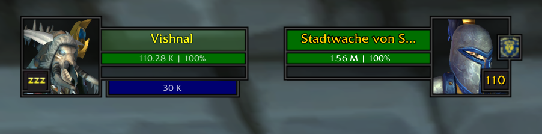
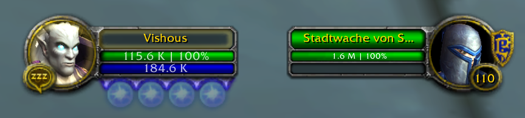

# QhunUnitHealth

A World of Warcraft addon based on by `QhunCore` library. It prints configurable life and resource texts onto the default unit frame UI.

## Installation

This addon requires `QhunCore` (version > 2.0.0) as a library addon. You need to unzip the addon and drop the contents into your World of Warcraft `Interface/Addons` folder.

## Configuration

This addon can be configured ingame. Please visit the `Interface > Addon` settings in the default game menu. You will find a section called `QhunUnitHealth`. Adjust these default settings if you like.

## Supported Languages
- German (Deutsch)
- English (English)

English will be the default language. The language will be choosen depending of your game client language setting.

## Special Thanks
- Vishous@Alleria (Beta test)

## Example Pictures

---

## Things todo before version 1.0.0 release:
- Show only percentage values
- Choose between character and global stored values
- Adjust the color for life and resource texts